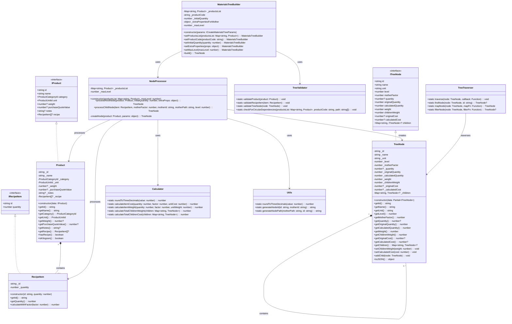

# Class Diagram for createMaterialsTree Refactoring

## Architecture Description

The proposed architecture follows SOLID principles and uses design patterns such
as Builder and Strategy to create a modular and extensible solution.

### Main Components

1. **Data Models**
   - `Product`: Represents a product with all its properties and helper methods
   - `RecipeItem`: Represents a recipe item with quantity and calculation
     methods
   - `TreeNode`: Represents a node in the materials tree, with calculated
     properties

2. **Services and Utilities**
   - `Calculator`: Centralizes all cost and weight calculations
   - `TreeValidator`: Performs validations at different levels of the tree
   - `Utils`: Provides utility functions such as rounding and ID generation

3. **Builders and Managers**
   - `MaterialsTreeBuilder`: Implements the Builder pattern for tree
     construction
   - `NodeProcessor`: Processes individual nodes and manages recursion
   - `TreeTraverser`: Provides methods to traverse and manipulate the tree

### Execution Flow

1. The client instantiates a `MaterialsTreeBuilder` with the necessary
   parameters
2. The builder configures the options and delegates tree creation to the
   `NodeProcessor`
3. The `NodeProcessor` creates the root node and recursively processes the
   children
4. The `Calculator` is used to perform cost and weight calculations
5. The `TreeValidator` validates the structure at different points
6. The final result is a tree of `TreeNode` objects that can be converted to
   JSON

### Advantages of the New Architecture

1. **Separation of Concerns**: Each class has a single responsibility
2. **Extensibility**: Easy to add new types of calculations or validations
3. **Testability**: Small, focused classes are easier to test
4. **Maintainability**: More organized and readable code
5. **Reusability**: Components can be reused in other contexts
