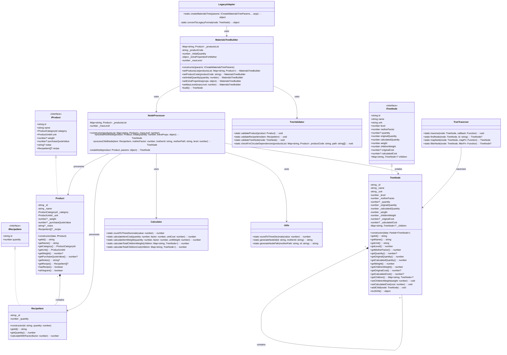

# Diagrama de Classes para Refatoração do createMaterialsTree

## Descrição da Arquitetura

A arquitetura proposta segue os princípios SOLID e utiliza padrões de design
como Builder e Strategy para criar uma solução modular e extensível.

### Principais Componentes

1. **Modelos de Dados**
   - `Product`: Representa um produto com todas suas propriedades e métodos
     auxiliares
   - `RecipeItem`: Representa um item de receita com quantidade e métodos de
     cálculo
   - `TreeNode`: Representa um nó na árvore de materiais, com propriedades
     calculadas

2. **Serviços e Utilitários**
   - `Calculator`: Centraliza todos os cálculos de custo e peso
   - `TreeValidator`: Realiza validações em diferentes níveis da árvore
   - `Utils`: Fornece funções utilitárias como arredondamento e geração de IDs

3. **Construtores e Gerenciadores**
   - `MaterialsTreeBuilder`: Implementa o padrão Builder para construção da
     árvore
   - `NodeProcessor`: Processa nós individuais e gerencia a recursão
   - `TreeTraverser`: Fornece métodos para percorrer e manipular a árvore

4. **Adaptadores**
   - `LegacyAdapter`: Mantém compatibilidade com a API antiga

### Fluxo de Execução

1. O cliente instancia um `MaterialsTreeBuilder` com os parâmetros necessários
2. O builder configura as opções e delega a criação da árvore para o
   `NodeProcessor`
3. O `NodeProcessor` cria o nó raiz e processa recursivamente os filhos
4. O `Calculator` é usado para realizar cálculos de custo e peso
5. O `TreeValidator` valida a estrutura em diferentes pontos
6. O resultado final é uma árvore de objetos `TreeNode` que pode ser convertida
   para JSON

### Vantagens da Nova Arquitetura

1. **Separação de Responsabilidades**: Cada classe tem uma responsabilidade
   única
2. **Extensibilidade**: Fácil adicionar novos tipos de cálculos ou validações
3. **Testabilidade**: Classes pequenas e focadas são mais fáceis de testar
4. **Manutenibilidade**: Código mais organizado e legível
5. **Reutilização**: Componentes podem ser reutilizados em outros contextos
